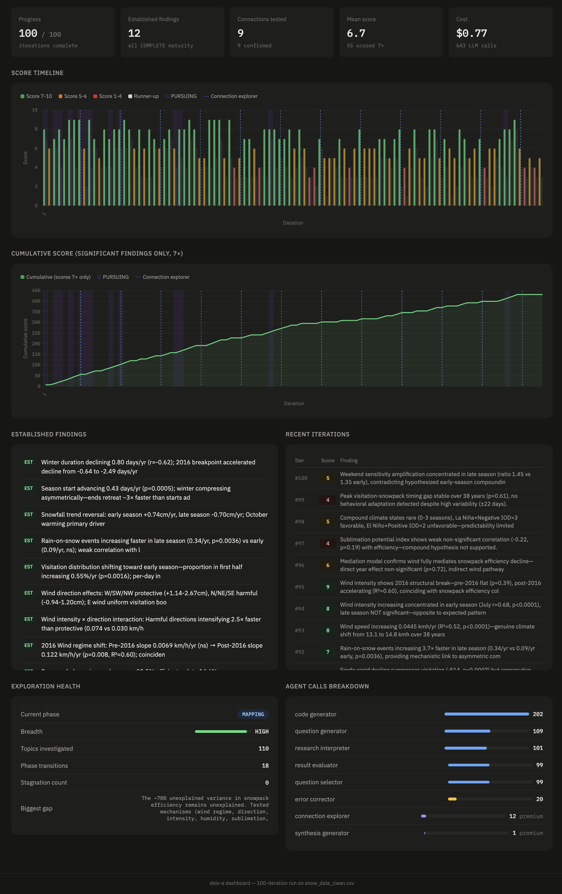

# delv-e

Autonomous data investigation powered by LLMs. Give it a dataset and a question — or just a question — and it recursively generates hypotheses, writes and executes analysis code, evaluates results, and adapts its exploration strategy based on what it discovers. Works with datasets (CSV, Excel, Parquet) or in computation-only mode for simulations, mathematical exploration, and numerical experiments.

The system implements a two-tier model architecture inspired by the division of labor observed in the [Knuth/Stappers/Claude collaboration](https://www-cs-faculty.stanford.edu/~knuth/papers/claude-cycles.pdf) and [analysed by Vishal Misra](https://medium.com/@vishalmisra/knuth-just-showed-us-where-to-put-the-human-013c0330ef0a) through the lens of Pearl's Causal Hierarchy. Cheap, fast models handle high-throughput pattern matching: writing code, scoring results, generating questions. A premium model provides strategic oversight every iteration, maintaining commitment to productive arcs, detecting when to pivot, naming the next direction, and preserving a narrative of *why* the exploration changed course. The goal is to approximate the role a human expert plays in guided AI exploration, without requiring one.

## Quick Start

```bash
# Install
pip install -r requirements.txt

# Set your API key(s)
cp .env.example .env
# Edit .env with your API keys

# Run with a dataset (OSS agents with premium strategic oversight)
python run.py data.csv "What factors drive churn?" \
    --agent-model openrouter:moonshotai/kimi-k2.5 \
    --code-model openrouter:moonshotai/kimi-k2.5 \
    --premium-model anthropic:claude-opus-4-6 \
    --iterations 50

# Run without a dataset (computation-only mode)
python run.py "Simulate the evolution of cooperation using iterated Prisoner's Dilemma" \
    --agent-model openrouter:moonshotai/kimi-k2.5 \
    --code-model openrouter:moonshotai/kimi-k2.5 \
    --premium-model anthropic:claude-opus-4-6 \
    --iterations 50
```

## Design Philosophy

When Claude Opus 4.6 solved an open combinatorics problem for Donald Knuth in March 2026, it didn't work alone. Filip Stappers coached the model through 31 explorations, forcing it to document progress, redirecting unproductive strategies, and maintaining the arc of the investigation across context losses. Knuth then proved why the construction works. Three participants, three distinct roles.

Vishal Misra [framed this](https://medium.com/@vishalmisra/knuth-just-showed-us-where-to-put-the-human-013c0330ef0a) through Judea Pearl's Causal Hierarchy. Claude's contribution was **Rung 1**: extraordinary associative pattern matching within each exploration. Stappers' contribution was **Rung 2**: intervention, changing the tools, redirecting strategy, maintaining coherence across the model's context losses. Knuth's was **Rung 3**: counterfactual reasoning, proving the construction works for values never computed.

delv-e attempts to replicate this division of labor without a human in the loop:

**Rung 1: cheap models at speed.** The code generator, evaluator, question generator, and research model updater are all fast, inexpensive models doing what LLMs do best: pattern matching, code writing, and structured summarization. They run 5-6 calls per iteration.

**Rung 2: premium model as strategic overseer.** A stronger model runs a strategic review every iteration. It reads the full research model (including a Strategic Trajectory it exclusively maintains), recent result digests with analytical methods used, and the dataset profile. It decides whether to hold commitment on the current arc, pivot to a new direction, or abandon an exhausted line of inquiry. When it pivots, it names the specific next direction as a binding constraint that the question generator must follow. This is the Stappers role: maintaining the arc of the investigation with the authority to redirect.

The strategic review also identifies missed opportunities (columns or techniques the cheaper models have overlooked) and surfaces untested cross-finding connections through the trajectory. Its Strategic Trajectory section, a narrative record of why pivots happened and what the current commitment is, is structurally protected from corruption by the cheaper model that updates the rest of the research model.

On any iteration, the strategic review assesses whether a **reframing probe** is warranted. This can happen on a pivot (suspicious null where the test may be wrong), on a hold (positive finding that could be reframed more sharply), or on an abandon (arc completing where distributional patterns in the raw numbers may have been missed). When the review flags PROBE_NEEDED, the premium model receives the full uncompressed analytical output from the last three analyses, and is asked: what pattern, threshold, or distributional feature in these numbers does the headline test not capture? If it finds an alternative framing, that becomes the binding direction for the next iteration. This mechanism exists because the reframings that produce the most valuable analytical insights typically emerge from looking at raw numbers with fresh eyes, not from reading compressed digests.

When an original arc completes, a **perspective rotation** generates 2-3 fundamentally different analytical lenses on the same phenomenon, ranked from most to least promising. An arc that investigated "what factors cause outcome Y to decline" (mechanistic perspective) might spawn perspectives like "how frequently do positive vs negative events occur" (event counting) or "has the system's capacity to convert input into outcome changed" (efficiency analysis). These are not deeper investigations of the same kind but different kinds of questions about the same subject. The top-ranked perspective is automatically pursued for 1-2 iterations under normal commitment rules: if findings are strong, the system keeps pursuing; if weak, it abandons quickly and moves to the next planned arc. Perspective arcs do not spawn further rotations, preventing recursive proliferation. The remaining perspectives are discarded — the next arc completion generates fresh perspectives relevant to that arc. The mechanism addresses a structural blind spot: the system naturally deepens each topic through one analytical lens but never switches lenses unless forced to.

**Rung 3: synthesis.** After all exploration iterations complete, the premium model generates a narrative synthesis report that integrates findings across the entire run, resolves contradictions, and draws conclusions about conditions not directly tested. The synthesis follows a tension-first narrative structure: a paradox-driven title, rejected alternative explanations, key findings ordered by causal logic with declarative section titles, cross-cutting patterns that unify multiple findings, open questions separated from methodological caveats, and a scannable stable/changing/declining summary. A post-synthesis visualization pass generates publication-quality charts for each key finding, adapted from the original analysis code that produced those findings to ensure the charts faithfully represent the methodology. The final output is a styled HTML report with clickable citation links to the original analyses, embedded charts, dark mode support, and PDF export.

The key insight from the article: strategic coherence requires a capable model with full context and override authority, while high-throughput exploration is best handled by faster, cheaper models doing what they're good at. The fix for divergence is structural division of labor.

## How It Works

Before the main loop, an **orientation phase** profiles the dataset's analytical landscape: column coverage, group sizes, confounders, power boundaries, derivable variables, and sparse-column artifacts. This produces a compact brief pinned into every agent's context for the entire run. (In computation-only mode, orientation is skipped — the system begins directly with seed decomposition.)

Then a **seed decomposition** step (premium model) converts the user's research agenda into a focused first analysis and an initial Strategic Trajectory. A broad multi-part question becomes a specific first task with a logical sequence of investigation arcs scaled to the iteration budget.

Each iteration:

1. **Generate questions**: LLM proposes analytical questions guided by the research model and the Strategic Trajectory. When the strategic review has issued a HOLD, questions deepen the current arc. On PIVOT or ABANDON, a binding direction constraint focuses all questions on the new arc
2. **Write & execute code**: code model writes Python, runs it against your DataFrame. A `pitfalls.txt` file of known API issues (scipy changes, pandas deprecations, type traps) is loaded fresh on every code generation call. Runtime error patterns (library-specific AttributeErrors) are recorded and injected into future prompts to prevent repeated failures
3. **Evaluate results**: LLM scores parallel solutions, selects the best, and generates finding summaries
4. **Update research model**: living document of hypotheses, findings, maturity tracking, cross-finding connections, and exploration health
5. **Strategic review**: premium model reads the full research model, recent results, and data profile. Issues a commitment — HOLD, PIVOT, or ABANDON — with the authority to redirect the entire investigation. Can request a reframing probe or trigger a perspective rotation when an arc completes. Can signal EARLY_STOP when the investigation is genuinely complete (see Auto-Stop below)

A live dashboard (`output/dashboard.html`) updates after each iteration. Open it in a browser to monitor progress, scores, findings, and exploration health in real time.



### Commitment System

The strategic review issues one of three commitments every iteration. This commitment determines the character of the next iteration's questions and analyses:

| Commitment | Meaning | Effect |
|---|---|---|
| **HOLD** | Current arc is productive | Deepen: questions target the same finding's next maturity stage |
| **PIVOT** | New direction identified | Redirect: next_direction becomes binding constraint for question generation |
| **ABANDON** | Current arc exhausted | Move on: system transitions to a new arc or the next planned direction |

The commitment is enforced structurally until the next strategic review changes it. Commitment control lives entirely in the premium model, preventing the oscillation that occurs when a cheap model pattern-matches "this looks like it needs breadth" one iteration and "this looks like it needs depth" the next.

The dashboard displays the commitment posture as a colored bar on each iteration: cyan for EXPLORING (first iteration of an arc), yellow for HOLD, green for PIVOT, red for ABANDON. Commitment history is recorded in the checkpoint for analysis.

### Finding Maturity

Significant findings (score 7+) are tracked through an analytical arc:

| Stage | What it means | Next step |
|---|---|---|
| **DETECTED** | Signal found, direction known | Quantify: rate, magnitude, significance |
| **QUANTIFIED** | Effect size precisely established | Decompose: subgroups, percentiles, time periods |
| **DECOMPOSED** | Distribution characterised | Regime-test: structural breaks, rolling windows |
| **REGIME-TESTED** | Temporal stability checked | Connect: test interactions with other findings |
| **COMPLETE** | Operationally interpretable | Graduate; eligible for cross-finding connections |

The maturity tracker prevents premature abandonment. The system stays committed until the active finding reaches maturity or is contradicted.

### Cross-Finding Connections

The strategic review (premium model) monitors untested interactions between established findings as part of its every-iteration assessment. When it identifies promising untested pairs, it surfaces them through two channels:

- **NEXT AFTER COMMITMENT** in the Strategic Trajectory, queuing connection tests as the next investigation arc
- **NEXT_DIRECTION** on pivot, making a specific connection test the binding constraint for the next arc

Connection types the system looks for: compounding (do they amplify each other?), mediating (does one explain the other?), conditional (does one modify the other?), and contradicting (do they point in opposite directions?). Results are tracked in the research model and graduated to established findings when confirmed.

### Auto-Stop

When `auto_stop=True`, the system can terminate before `max_iterations` when it determines the investigation is genuinely complete. Two independent signals trigger early termination (either is sufficient):

1. **Strategic review explicit request.** The premium model sets `EARLY_STOP: YES` when all finding maturity items are complete, no unexplored territory remains, and recent iterations have been unproductive. This requires all four conditions: no unexplored territory, all maturity items complete or stalled, 5+ consecutive ABANDONs, and the biggest gap requires external data.

2. **Mechanical backstop.** If the last 8 consecutive commitments are ABANDON and the mean score during that streak is below 6.0, the system stops regardless of the strategic review's recommendation.

Auto-stop never triggers before iteration 15, ensuring the investigation has time to establish findings before assessing completeness. When triggered, the system prints "Investigation complete — proceeding to synthesis" and falls through to the same post-loop sequence: synthesis generation, chart generation, HTML report, and final dashboard write.

```bash
# Enable auto-stop
python run.py data.csv "Analyze trends" --iterations 100 --auto-stop
```

Default is `auto_stop=False` — the full iteration budget is always used unless explicitly opted in.

### Error Patterns and Pitfalls

The code generator benefits from two sources of error prevention:

**Static pitfalls** (`pitfalls.txt`): A user-maintained file of known code generation traps. Loaded fresh on every code generation call, so edits take effect mid-run without restart. Ships with 10 entries covering scipy API changes, pandas deprecations, stats gotchas, and type traps. Add your own as you discover patterns.

**Runtime error patterns**: When code execution fails, the system records library-specific errors (e.g., `AttributeError: module 'scipy.stats' has no attribute 'diptest'`) and injects them into all future code generation prompts. Only meaningful errors are kept — AttributeErrors on library-specific classes, plus all ModuleNotFoundError/ImportError. Generic errors (ndarray, DataFrame, NoneType) are filtered out.

Both sources are combined and appended to the code generator's prompt, preventing the same errors from recurring across iterations.

## Usage

```
python run.py [<dataset>] ["<question>"] [options]
```

The dataset is optional. If the first argument is not a file path, it is treated as the question and the system runs in computation-only mode.

| Option | Default | Description |
|---|---|---|
| `--iterations N` | 5 | Exploration iterations |
| `--parallel N` | 2 | Parallel solutions per iteration |
| `--output DIR` | output/ | Output directory |
| `--continue` | | Resume from previous run's checkpoint |
| `--no-orientation` | | Skip the orientation phase (data profiling) |
| `--auto-stop` | | Allow early termination when investigation is complete |
| `--agent-model` | anthropic:claude-haiku-4-5-20251001 | Model for agents (evaluator, QG, RI, selector) |
| `--code-model` | anthropic:claude-haiku-4-5-20251001 | Model for code generation |
| `--premium-model` | same as code-model | Model for orientation, strategic review, and synthesis |

### Providers

Model format: `provider:model_name`

| Provider | Example | Requires |
|---|---|---|
| Anthropic | `anthropic:claude-haiku-4-5-20251001` | `ANTHROPIC_API_KEY` |
| OpenAI | `openai:gpt-5.4` | `OPENAI_API_KEY` |
| OpenRouter | `openrouter:moonshotai/kimi-k2.5` | `OPEN_ROUTER_API_KEY` |
| Ollama | `ollama:qwen3:30b` | Local Ollama server |

OpenRouter provides access to hundreds of models (DeepSeek, Qwen, Kimi, GLM, Gemini, Llama, etc.) via a single API key. See [openrouter.ai/models](https://openrouter.ai/models) for available models and pricing.

### Examples

```bash
# All Haiku (cheapest cloud option)
python run.py data.csv "Analyze trends" --iterations 15

# Quick 3-iteration run, skip orientation
python run.py data.csv "What's the class balance?" --iterations 3 --no-orientation

# 100 iterations with auto-stop
python run.py data.csv "What drives peak snowpack decline?" \
    --agent-model openrouter:moonshotai/kimi-k2.5 \
    --code-model openrouter:moonshotai/kimi-k2.5 \
    --premium-model anthropic:claude-opus-4-6 \
    --iterations 100 --auto-stop

# Local Ollama with premium strategic oversight
python run.py data.csv "Deep analysis" \
    --agent-model ollama:qwen3:30b \
    --code-model ollama:qwen3:30b \
    --premium-model anthropic:claude-opus-4-6
```

### Computation-Only Mode

When no dataset is provided, the system runs in computation-only mode. The code generator has access to the full scientific Python stack (numpy, scipy, sympy, pandas, networkx, statsmodels, scikit-learn) and generates code that creates, simulates, or computes rather than analysing an existing DataFrame.

```bash
# Evolutionary game theory simulation
python run.py "Simulate the evolution of cooperation using iterated Prisoner's Dilemma" \
    --iterations 100

# Number theory exploration
python run.py "Explore the distribution of twin prime gaps up to 10^8" \
    --iterations 50

# Dynamical systems
python run.py "Model predator-prey dynamics with 5 species and environmental shocks" \
    --agent-model ollama:glm-5.1:cloud \
    --code-model ollama:kimi-k2.5:cloud \
    --premium-model anthropic:claude-opus-4-6 \
    --iterations 100

# Monte Carlo optimisation
python run.py "Find optimal warehouse placement for 50 delivery points with stochastic demand" \
    --iterations 30
```

The intelligence loop — research model, strategic review, question generation, synthesis — works identically in both modes. The only difference is how each iteration's investigation step executes: against a dataset or as standalone computation.

## Resuming Runs

Checkpoint saved after every iteration. Resume with `--continue`:

```bash
# Initial run
python run.py shoes.csv "Analyze shoe efficiency" --iterations 25

# Continue with a new direction (iterations are additive)
python run.py shoes.csv "Pursue the cardiovascular paradox" --continue --iterations 30
```

The seed question on `--continue` becomes the first analysis in the resumed run. The DataFrame, research model, insight tree, commitment history, and all context are preserved. You can switch models between runs.

## Output

```
output/
├── dashboard.html               # Live dashboard with "View Report" button
├── synthesis_report.md          # Final synthesis in markdown
├── synthesis_report.html        # Styled HTML report with charts and citation links
├── synthesis_charts/            # Publication-quality charts for key findings
│   ├── 01_supply_retention_gap.png
│   ├── 02_ne_wind_quadrupled.png
│   └── ...
├── research_model.md            # Hypotheses, findings, maturity, connections, gaps
├── run_log.json                 # Full log of every LLM call
├── state.json                   # Checkpoint for --continue
├── dataframe.parquet            # Preserved DataFrame
├── cost.txt                     # Cost breakdown by agent
├── orientation/
│   └── analysis.md              # Dataset analytical profile
└── exploration/
    ├── 01/
    │   ├── _summary.md          # Iteration evaluation + commitment decision
    │   └── 1773198695/
    │       ├── analysis.md      # Question + code + output
    │       ├── analysis.html    # Styled HTML with "← Back to Report" link
    │       └── plot_001.png
    ├── 02/
    └── ...
```

### Synthesis Report

The synthesis report is generated after all exploration iterations complete (or when auto-stop triggers). It produces three artifacts:

**synthesis_report.md** — The raw markdown synthesis with `[[chain_id]]` citation markers.

**synthesis_report.html** — A self-contained styled HTML report. Citation markers become clickable links to individual analysis pages showing the original code, output, and plots. Each analysis page has a "← Back to Report" link. The report includes a "← Dashboard" link at the top and an "⬇ Export PDF" button at the bottom. Dark mode supported via `prefers-color-scheme`.

**synthesis_charts/** — One publication-quality matplotlib chart per key finding section. Charts are generated by the premium model, which receives the original analysis code that produced the finding and adapts it into a visualization. This ensures charts use the same filters, groupings, and calculations as the original analysis — numbers on the chart match numbers in the text. Charts are embedded inline in the HTML report.

The dashboard shows a green "View Report" button when the run completes, linking directly to the HTML synthesis report.

## Memory Architecture

LLMs have no memory between calls. delv-e manages context through five layers:

**Data Profile** produced by the orientation phase before iteration 1. A compact analytical brief (~500-1000 tokens) covering column coverage, group sizes, confounders, power boundaries, derivable variables, and sparse-column artifacts. The orientation is aware of coverage-driven correlation artifacts (e.g., two sparse columns appearing correlated because they're both only recorded during the same operational period). Pinned into every agent's context for the entire run.

**Insight Tree** where every analysis is a node with question, results, score, and summaries. Agents see a tiered view: recent entries with RI-curated key numbers (result_digest), older entries compressed to one-sentence summaries (finding_summary from the evaluator). Nothing is deleted. The system manages visibility, not existence. Non-winning solutions from parallel evaluation are stored as runner-ups for completeness but are not revisited.

**Research Model**, a structured document updated after every iteration and read by every agent:
- *Active Hypotheses* (max 4): testable claims the next analysis could change
- *Established Findings* (max 10): confirmed facts with quantitative anchors
- *Finding Maturity* (max 5): significant findings tracked through DETECTED, QUANTIFIED, DECOMPOSED, REGIME-TESTED, COMPLETE, each with a specific next analytical step
- *Cross-Finding Connections* (max 5): tested and untested interactions between findings
- *Attention Flags*: findings where later analyses produced contradictory results
- *Biggest Gap*: the most important thing not yet investigated (flags when stuck)
- *Exploration Health*: honest self-assessment of breadth, recent topic concentration, and unexplored territory. This section informs strategic direction: when the research model reports low breadth, the strategic review pivots to new territory
- *Strategic Trajectory*: maintained exclusively by the premium model's strategic review. Records why pivots happened, what the current commitment is, and what direction has the highest expected value next. The cheap model updater is structurally prevented from modifying this section. The trajectory is extracted before each model update and re-spliced after, ensuring the premium model's strategic memory is never corrupted by the cheaper model

**Q&A Pairs** where the Code Generator sees a summary-based format: recent pairs (last 40) with finding summaries and chain IDs, providing tactical context without overwhelming the prompt. The dataset column list is injected separately to help the code generator reference correct column names.

**Full Results Store** holding untruncated results from every analysis, never shown to agents during exploration. Used only by the Synthesis Generator, which receives all active findings (score-weighted) plus the full research model. Orientation, seed decomposition, and synthesis use the premium model via `--premium-model`. The strategic review also uses the premium model on every iteration, reading the full research model, the data profile, and recent result digests (including analytical method used) to maintain strategic coherence. In a 100-iteration run the premium model accounts for ~115 calls (100 strategic reviews + orientation + seed decomposition + synthesis + ~5 reframing probes + ~8 perspective rotations + ~8 synthesis charts) while the remaining ~535 use cheaper models. The per-review cost is low (~6K input tokens, ~600 output tokens) because the review reads structured summaries, not raw results.

### Context Management

The system uses two schema modes: a full schema for the Code Generator, and a slim schema (column names, types, and unique counts only) for all other agents. For datasets with more than 50 columns, `head()` and `describe()` are omitted from the full schema. This reduces code generator input by up to 70% on wide datasets.

The Question Generator uses a two-tier format for historical questions: the 30 most recent in full, older questions compressed to 120-character snippets. This keeps the QG informed of exploration history without unbounded prompt growth.

The evaluator generates one-sentence summaries for all parallel solutions (not just the winner), giving every node in the insight tree an LLM-curated finding_summary. The Research Interpreter generates a 3-5 line result_digest of key numbers for winning nodes only.

## Cost

| Configuration | ~Cost per 10 iterations |
|---|---|
| All Haiku | $0.50-1.50 |
| Haiku agents + Opus code | $2-4 |
| OpenRouter OSS (kimi/glm) | $0.50-1.00 |
| All Ollama (local) | Free |
| Ollama + Opus premium | ~$1.00 (orientation + strategic review + synthesis) |

The strategic review (premium model) runs every iteration but is lightweight, roughly 6K input tokens and 600 output tokens per call. Over 100 iterations this adds roughly $7 at Opus pricing. Synthesis generation adds ~$0.50 and synthesis chart generation adds ~$0.50-0.80 (one premium model call per key finding chart). Total premium model cost for a 100-iteration run is typically $8-10.

Check `output/cost.txt` after each run for exact breakdown by agent.

## Architecture

```
run.py               CLI: dataset loading, --continue handling, --auto-stop flag
engine.py            ExplorationEngine: LLM pipeline, code execution, orientation
auto_explore.py      Core loop: commitment system, strategic review, perspective rotation,
                     auto-stop, synthesis charts, research model management
output.py            OutputManager: all rendering — terminal display, analysis markdown,
                     iteration summaries, final outputs, synthesis HTML, PDF export
dashboard.py         Live HTML dashboard with commitment bands, "View Report" button
llm.py               Multi-provider LLM client (Anthropic, OpenAI, OpenRouter, Ollama)
executor.py          Local code execution with security guards and traceback filtering
prompts.py           All prompt templates (agents, code gen, orientation, strategic review,
                     synthesis narrative structure, synthesis charts)
style.py             Terminal formatting: colored commitment bars, exploration tree, spinners
pitfalls.txt         Static code generation hints (user-editable, live-reloaded)
logger_config.py     Logging configuration
```

## Security

Generated code runs locally via `exec()`. A module blacklist blocks dangerous operations (subprocess, socket, file deletion, network access) but this is **not a sandbox**. See `executor.py` for the full blacklist. API keys are read from environment variables only, never logged or stored.

## Origin

Standalone extraction of the auto-explore module from [BambooAI](https://github.com/pgalko/BambooAI). Core exploration logic preserved; web UI, database, billing, and multi-tenant routing replaced with minimal local equivalents.