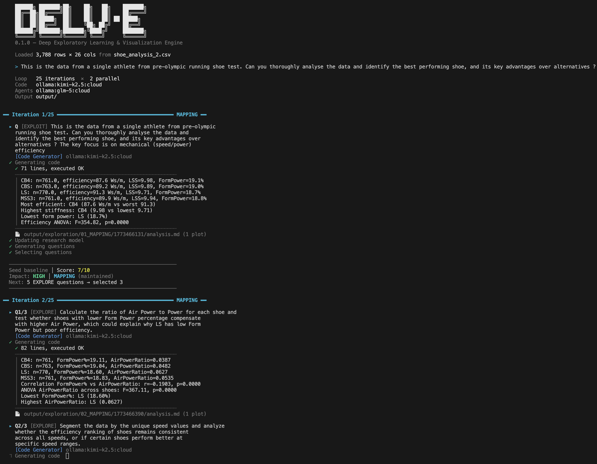

# delv-e

Autonomous, long-running data investigation powered by LLMs. Give it a dataset and a seed question — it recursively generates hypotheses, writes and executes analysis code, evaluates results, and adapts its exploration strategy based on what it discovers. Capable of running autonomously for hours over hundreds of iterations. Every step produces a detailed analysis report coupled with charts and visualisations, with a final synthesis report at the end of the run tying everything together.

## Quick Start

```bash
# Install
pip install -r requirements.txt

# Set your API key(s)
cp .env.example .env
# Edit .env with your API keys

# Run
python run.py data.csv "What factors drive churn?" --iterations 10
```

## How It Works




Each iteration:

1. **Generate questions** — LLM proposes analytical questions based on findings so far
2. **Write & execute code** — code model writes Python, runs it against your DataFrame
3. **Evaluate results** — LLM scores parallel solutions, summarises findings, detects stagnation
4. **Update research model** — living document of hypotheses, findings, and open gaps
5. **Decide what's next** — phase system shifts between exploration modes based on progress

### Phase System

| Phase | Mode | Triggers |
|---|---|---|
| **MAPPING** | Broad survey | Thread completed, CONVERGING exhausted |
| **PURSUING** | Deep dive on a lead | High model impact, oscillation cooldown |
| **CONVERGING** | Pressure-test findings | Evaluator stagnation (2+ consecutive), sustained low model impact, low evaluator scores |
| **REFRAMING** | Different angle | Contradiction confirmed by low evaluator score |

CONVERGING is the diminishing-returns detector. It activates when the evaluator independently flags consecutive iterations as stagnating, when the RI reports sustained LOW model impact, or when winning scores drop below 6 for three consecutive iterations. Once in CONVERGING, the system generates questions that look for disconfirming evidence and simpler alternative explanations.

## Usage

```
python run.py <dataset> ["<question>"] [options]
```

| Option | Default | Description |
|---|---|---|
| `--iterations N` | 5 | Exploration iterations |
| `--parallel N` | 2 | Parallel solutions per iteration |
| `--output DIR` | output/ | Output directory |
| `--continue` | | Resume from previous run's checkpoint |
| `--agent-model` | anthropic:claude-haiku-4-5-20251001 | Model for agents (evaluator, QG, RI, selector) |
| `--code-model` | anthropic:claude-haiku-4-5-20251001 | Model for code generation and synthesis |

### Providers

Model format: `provider:model_name`

| Provider | Example | Requires |
|---|---|---|
| Anthropic | `anthropic:claude-haiku-4-5-20251001` | `ANTHROPIC_API_KEY` |
| OpenAI | `openai:gpt-5.4` | `OPENAI_API_KEY` |
| OpenRouter | `openrouter:moonshotai/kimi-k2.5` | `OPEN_ROUTER_API_KEY` |
| Ollama | `ollama:qwen3:30b` | Local Ollama server |

OpenRouter provides access to hundreds of models (DeepSeek, Qwen, Kimi, GLM, Gemini, Llama, etc.) via a single API key. See [openrouter.ai/models](https://openrouter.ai/models) for available models and pricing.

### Examples

```bash
# All Haiku (cheapest cloud option)
python run.py data.csv "Analyze trends" --iterations 15

# OSS models via OpenRouter
python run.py data.csv "What predicts price?" \
    --agent-model openrouter:moonshotai/kimi-k2.5 \
    --code-model openrouter:moonshotai/kimi-k2.5 \
    --iterations 15

# Mix providers — OSS agents, Anthropic code
python run.py data.csv "Deep analysis" \
    --agent-model openrouter:z-ai/glm-5 \
    --code-model anthropic:claude-haiku-4-5-20251001 \
    --iterations 15

# Ollama - Local agents, Cloud code
python run.py data.csv "Quick look" \
    --agent-model ollama:qwen3:30b \
    --code-model ollama:kimi-k2.5:cloud \
    --iterations 15
```

## Resuming Runs

Checkpoint saved after every iteration. Resume with `--continue`:

```bash
# Initial run
python run.py shoes.csv "Analyze shoe efficiency" --iterations 25

# Continue with a new direction (iterations are additive)
python run.py shoes.csv "Pursue the cardiovascular paradox" --continue --iterations 30
```

The seed question on `--continue` becomes the first analysis in the resumed run. The DataFrame, research model, insight tree, phase history, and all context are preserved. You can switch models between runs.

## Output

```
output/
├── synthesis_report.md      # Final report with citations
├── research_model.md        # Hypotheses, findings, gaps
├── run_log.json             # Full log of every LLM call
├── state.json               # Checkpoint for --continue
├── dataframe.parquet        # Preserved DataFrame
├── cost.txt                 # Cost breakdown
└── exploration/
    ├── 01_MAPPING/
    │   ├── _summary.md      # Iteration evaluation + phase decision
    │   └── 1773198695/
    │       ├── analysis.md  # Question + code + output
    │       └── plot_001.png
    ├── 02_PURSUING/
    └── ...
```

## Memory Architecture

LLMs have no memory between calls. delv-e manages context through four layers:

**Insight Tree** — every analysis is a node with question, results, score, and summaries. Agents see a tiered view: recent entries with RI-curated key numbers (result_digest), older entries compressed to one-sentence summaries (finding_summary from the evaluator). Nothing is deleted — the system manages visibility, not existence.

**Research Model** — a structured document tracking active hypotheses, established findings (each with a quantitative anchor), open threads, and the biggest gap driving the next investigation. Updated after every iteration, read by every agent. This is how findings from iteration 3 still influence question generation at iteration 50.

**Q&A Pairs** — the Code Generator sees the 20 most recent question-result pairs plus the full dataset schema. A deliberate sliding window — the code writer needs tactical context, not the full exploration history.

**Full Results Store** — untruncated results from every analysis, never shown to agents during exploration. Used only by the Synthesis Generator, which selects up to 40 analyses via score-weighted selection (top-scoring from the entire run + most recent 15 for continuity).

### Context Management

The system uses two schema modes: a full schema (with `head()` and `describe()`) for the Code Generator, and a slim schema (column names, types, and unique counts only) for all other agents — an 80% reduction.

The evaluator generates one-sentence summaries for all parallel solutions (not just the winner), giving every node in the tree an LLM-curated finding_summary. The RI generates a 3-5 line result_digest of key numbers for winning nodes only. Non-winning nodes that are marked dormant get hypothesis labels combining the question and finding summary, which direct the QG on branch switches.

## Cost

| Configuration | ~Cost per 10 iterations |
|---|---|
| All Haiku | $0.50–1.50 |
| Haiku agents + Opus code | $2–4 |
| OpenRouter OSS (kimi/glm) | $0.50–1.00 |
| All Ollama (local) | Free |

Check `output/cost.txt` after each run for exact breakdown by agent.

## Architecture

```
run.py               CLI — dataset loading, --continue handling
engine.py            ExplorationEngine — runtime, code execution, file output
auto_explore.py      Core loop — phases, research model, insight tree, stagnation
llm.py               Multi-provider LLM client (Anthropic, OpenAI, OpenRouter, Ollama)
executor.py          Local code execution with security guards
prompts.py           All prompt templates
style.py             Terminal formatting
output.py            Print routing
logger_config.py     Logging configuration
```

## Security

Generated code runs locally via `exec()`. A module blacklist blocks dangerous operations (subprocess, socket, file deletion, network access) but this is **not a sandbox**. See `executor.py` for the full blacklist. API keys are read from environment variables only, never logged or stored.

## Origin

Standalone extraction of the auto-explore module from [BambooAI](https://bambooai.io). Core exploration logic preserved; web UI, database, billing, and multi-tenant routing replaced with minimal local equivalents.
